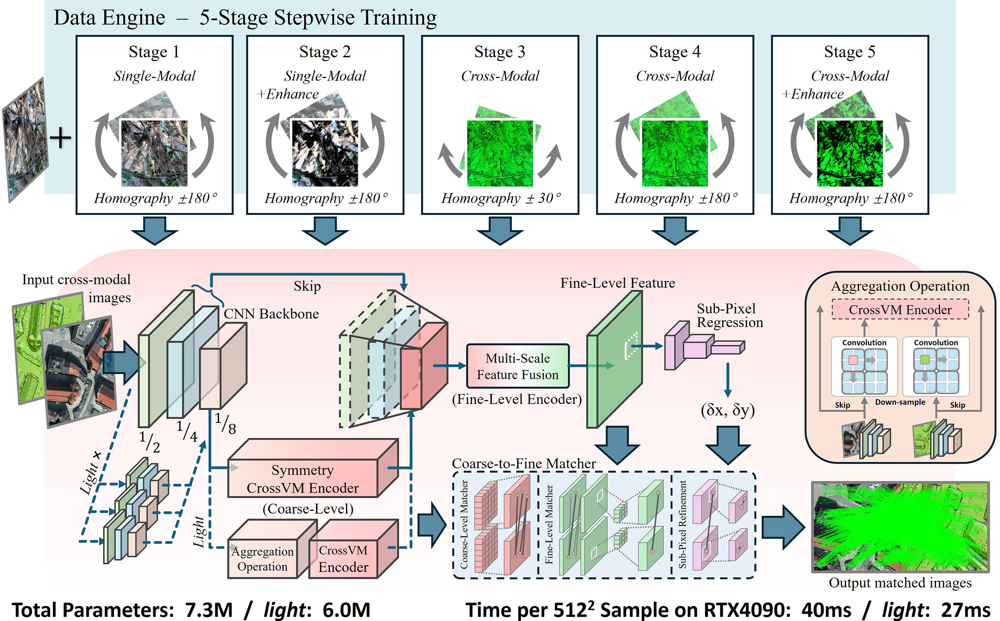
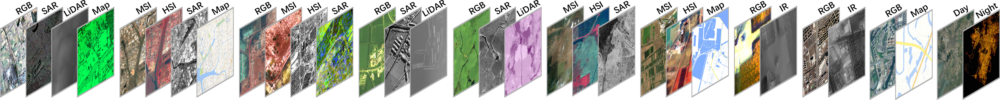

# MIFTr: Efficient Universal Image Matching with Modality-Invariant Feature Transformer



Paper Link: http://ieeexplore.ieee.org/document/11480196

If you have any queries or suggestions, please do not hesitate to contact me (gao-pingqi@qq.com). If you are from China, you may just speak Chinese~ 中国人直接说中文就可以了~

** The author is now busy with graduation, causing a delay of open-source work. The codes and datasets will be publicly available soon.


## 📈 Matching Performance

[](https://youtu.be/bu4Rvz1PkXo)
[](https://youtu.be/n0W10ZYU7ZA)
[](https://youtu.be/5FIG1X7Zd8k)
[](https://youtu.be/LL5rHqSR0jg)


## 💾 Model Weights

Google Drive: https://drive.google.com/drive/folders/1Sr08M5Y-XbbJ4BHd56mFSMZJRafU2ZjM?usp=sharing

Baidu Netdisk: https://pan.baidu.com/s/1kEnlfmo90BcMQwX9WYn5Rg?pwd=mift


## 📦 Datasets Release

*** Training database ***



Google Drive: https://drive.google.com/drive/folders/1sMWudiDA2u7STSZuzm0Pg0IxtzNyYkeq?usp=sharing

Baidu Netdisk: https://pan.baidu.com/s/1eZ3wjIBBCAs0FgGgvpniMA?pwd=bit6

<br>

*** Expanded MRSI<sup>[1-2]</sup> dataset ***

Google Drive: https://drive.google.com/drive/folders/1brDGGpvba_ZhobotgSk4vWuNWIhdtbHy?usp=sharing

Baidu Netdisk: https://pan.baidu.com/s/1UQcyX722a6nP5Jw8ykbUzQ?pwd=mrsi

<br>

*[1] J. Li, Q. Hu, and M. Ai, “RIFT: Multi-modal image matching based on radiation-variation insensitive feature transform,” IEEE Transactions on Image Processing, vol. 29, pp. 3296–3310, 2019.*

*[2] Y. Yao, Y. Zhang, Y. Wan, X. Liu, X. Yan, and J. Li, “Multi-modal remote sensing image matching considering co-occurrence filter,” IEEE Transactions on Image Processing, vol. 31, pp. 2584–2597, 2022.*


## 📚 Citation
If you find our work useful in your research, please consider citing:
```bibtex
@article{gao2026miftr,
  title={{MIFTr}: Efficient Universal Image Matching With Modality-Invariant Feature Transformer},
  author={Gao, Chenzhong and Gao, Yunhao and Weng, Desheng and Li, Jixuan and Li, Wei and Tao, Ran and Xia, Xiang-Gen},
  journal={IEEE Transactions on Geoscience and Remote Sensing},
  year={2026},
  volume={64},
  pages={1-17},
  publisher={IEEE}
}
```
